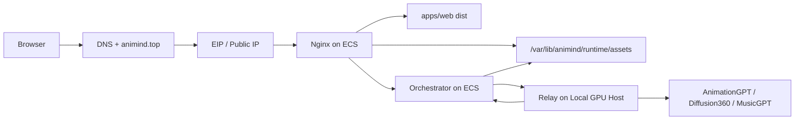

# Cloud Control Plane + Local Relay Design

**Date:** 2026-03-30

## Goal

将 Animind 演进为“云上前端 + 云上 Orchestrator + 本地 Relay”的双节点架构：用户统一通过 `https://animind.top` 访问前端、API、WebSocket 和生成结果；阿里云 ECS 仅承载控制面与静态入口；本地 GPU 机器通过 Relay 服务执行 motion / scene / music 模型任务，并把最终产物回传到云端运行时目录。

## Context

当前仓库已经具备单机本地运行的完整闭环：

- 前端是独立的 Vite 应用，默认同源访问 `/api`、`/ws` 和 `/assets`
- Orchestrator 已暴露：
  - `POST /api/jobs`
  - `GET /api/jobs/{job_id}`
  - `GET /api/jobs/{job_id}/events`
  - `WS /ws/jobs/{job_id}`
  - `GET /assets/{job_id}/...`
- 运行时目录已经可由 `ORCH_RUNTIME_DIR` 重定向

但当前真实模型执行链路仍是“Orchestrator 本机执行”：

- `animationgpt_local`
- `diffusion360_local`
- `musicgpt_cli`

仓库中只有一份 Relay 设计草案 [`docs/relay_design.md`](E:/OneDrive%20-%20Coventry%20University/大创/代码/.worktrees/cloud-deploy-relay-plan/docs/relay_design.md)，还没有对应实现。

## Confirmed Constraints

- 用户已确认目标态为“云上前端 + 云上 Orchestrator + 本地 Relay”
- 当前阿里云 ECS 规格为 `2 vCPU / 2 GiB / VPC`
- 域名 `animind.top` 已购入，公网入口计划使用 EIP + Nginx
- 手动控制台操作由用户执行：
  - EIP 绑定
  - 安全组配置
  - DNS A 记录
  - HTTPS 证书
  - ICP 备案判断与办理（若 ECS 在中国大陆地域）
- 浏览器侧最终只应感知一个域名入口，不感知本地 Relay 节点

## Decision Summary

### 1. 云端 ECS 只承载控制面

ECS 上部署以下组件：

- Nginx
- `apps/web` 构建产物
- Orchestrator（FastAPI + worker loop）
- Orchestrator runtime（`/var/lib/animind/runtime`）

ECS 不承载真实模型推理，不在其上安装大模型权重或 GPU 依赖。

### 2. 本地 GPU 机器承载 Relay

本地机器新增 Relay 服务，职责是：

- 接收云端 Orchestrator 发来的远程任务
- 在本地调用现有 AnimationGPT / Diffusion360 / MusicGPT 执行器
- 持久化任务状态、日志与临时产物
- 将最终产物上传回云端 Orchestrator

### 3. 云端 runtime 是唯一对外权威资产目录

浏览器永远只从云端读取 `/assets/{job_id}/...`。

这意味着：

- Relay 可以保留本地任务目录和调试产物
- 但用户最终下载、预览和导出的资源必须落到云端 `ORCH_RUNTIME_DIR/assets`
- Nginx 只暴露云端资产，不直连本地 Relay

### 4. motion / scene / music 切换为 remote providers

为保证前端无感，Orchestrator 需要新增 remote adapters：

- `animationgpt_relay`
- `diffusion360_relay`
- `musicgpt_relay`

部署到云上时，默认 provider 映射切到 relay profile：

- motion -> `animationgpt_relay`
- scene -> `diffusion360_relay`
- music -> `musicgpt_relay`

以下 provider 保持在云端执行：

- `builtin_library`
- `web_threejs`
- `ffmpeg_export`

原因：

- `character` 和 `preview` 是轻量逻辑，不值得远程化
- `export` 在产物已回传到云端后可继续在控制面侧完成，避免把最终交付逻辑拆成两半

## Target Architecture



## Component Responsibilities

### Browser

- 访问 `https://animind.top`
- 发起 `POST /api/jobs`
- 使用 SSE 或 WebSocket 订阅任务进度
- 从 `/assets` 读取 manifest、预览和最终交付文件

### Nginx

- 终止 TLS
- 托管前端静态文件
- 反代 `/api`
- 反代 `/ws`
- 托管或映射 `/assets`
- 对 SSE 关闭代理缓冲，对 WebSocket 显式转发 `Upgrade` / `Connection`

### Orchestrator

- 保持现有 UIR 生成、任务编排、SSE/WS 事件与 manifest 逻辑
- 根据 execution profile 选择 local / relay provider
- 对 relay provider 发起远程任务并轮询状态
- 接收 Relay 回传的产物并写入云端 runtime
- 将最终资产继续暴露给前端

### Relay

- 暴露最小 REST API：
  - `POST /v1/tasks`
  - `GET /v1/tasks/{task_id}`
  - `GET /v1/tasks/{task_id}/artifacts/{name}`
- 控制本地并发
- 运行本地执行器
- 将完成产物上传到云端 Orchestrator

### Local Executors

- 继续复用现有本机执行方式：
  - Python 脚本
  - EXE
  - 现有本地环境变量
- 不直接关心公网入口、域名和浏览器访问

## Data and Control Flow

### Job Creation

1. 前端调用 `POST /api/jobs`
2. Orchestrator 生成 UIR，并创建 job 目录与初始 manifest
3. worker 根据默认 provider profile 选择：
   - relay provider：motion / scene / music
   - cloud-local provider：character / preview / export

### Remote Execution

1. remote adapter 调用 Relay `POST /v1/tasks`
2. Relay 入队并返回 `task_id`
3. remote adapter 轮询 `GET /v1/tasks/{task_id}`
4. Relay 在本地执行真实模型
5. 产物完成后，Relay 调用云端：
   - `POST /api/jobs/{job_id}/relay-upload`
6. Orchestrator 将文件写入 `runtime/assets/<job_id>/...`
7. remote adapter 观察到任务进入 `succeeded`，返回和当前 job 对齐的 artifact refs
8. worker 继续执行 `preview` 和 `export`

### Asset Delivery

1. 前端读取 `manifest.json`
2. 前端通过 `/assets/{job_id}/...` 拉取：
   - panorama
   - bvh
   - wav
   - preview_config
   - final mp4 / zip

浏览器不直接接触 Relay 地址。

## Runtime and Persistence Model

### Cloud Runtime

建议使用：

- `/var/lib/animind/runtime/assets`
- `/var/lib/animind/runtime/cache`
- `/var/lib/animind/runtime/logs`
- `/var/lib/animind/runtime/jobs.db`

其中：

- `assets/` 面向 Nginx 暴露
- `jobs.db` 保存任务元数据、状态、阶段、时间戳、manifest 路径和最近错误

### Relay Runtime

建议使用：

```text
relay_runtime/
  tasks/{task_id}/
    input/
    work/
    artifacts/
    task.json
  logs/
  tmp/
  model_cache/
```

Relay runtime 只面向本地运维，不对浏览器公开。

## API Contract Additions

### Orchestrator: `POST /api/jobs/{job_id}/relay-upload`

用途：

- 接收 Relay 回传的最终产物
- 将文件写入 `ORCH_RUNTIME_DIR/assets/<job_id>/...`
- 返回云端权威 `uri` 列表

建议格式：

- `multipart/form-data`
- `manifest`：JSON 字符串，包含每个文件的：
  - `role`
  - `relative_path`
  - `mime`
  - `sha256`
  - `bytes`
- `files`：实际文件内容

### Relay: `POST /v1/tasks`

建议最小请求字段：

```json
{
  "job_id": "job_123",
  "kind": "motion",
  "input": {
    "prompt": "walk cycle"
  },
  "options": {
    "fps": 30,
    "duration_s": 8
  }
}
```

首版不引入 callback 注册接口，先用轮询 + 上传闭环完成落地。

## Security Model

### Public Exposure

对公网暴露的只有：

- `80/443` 到 Nginx
- `22` 到 ECS（且应做 IP 白名单）

Orchestrator 仅监听 `127.0.0.1:8000`。

### Relay Exposure

不建议把 Relay 直接暴露在公网。

本设计默认采用“ECS 与本地机器之间存在私网连通”的前提，例如：

- Tailscale
- WireGuard
- 企业 VPN
- 受限公网 + IP 白名单 + 强共享密钥

推荐顺序：

1. 私网 overlay
2. `X-Relay-Token`
3. 本地防火墙白名单
4. 日志脱敏

### Upload Authentication

`relay-upload` 必须校验共享 token，例如 `X-Relay-Token`，避免任意第三方伪造上传。

## Production Hardening Decisions

### Persistent Job Store

当前 `JobStore` 为内存实现，不适合部署到云上。

目标态改为：

- 内存索引 + SQLite 持久化
- 服务启动时从 SQLite 恢复 job 元数据
- 终态后仍保留任务索引与 manifest 路径

### CORS

生产环境是同源部署，`allow_origins=["*"]` 应改为：

- 默认关闭跨域
- 或按 env 显式允许 `https://animind.top`

### Logging

需要区分：

- Orchestrator 控制面日志
- Relay 执行日志
- 模型原始日志

且默认不记录：

- token
- 敏感路径
- 完整用户提示词（至少不进入高频系统日志）

## Rollout Strategy

### Phase A: Cloud Control Plane First

先完成：

- Nginx
- Web dist
- Orchestrator systemd
- runtime 外置
- HTTPS

此时可先保持本地开发或 mock provider 验证公网入口正确。

### Phase B: Relay Integration

再完成：

- remote adapters
- Relay service
- `relay-upload`
- provider profile 切换

### Phase C: Production Stabilization

最后补齐：

- SQLite job store
- smoke tests
- runbook
- 部署脚本

## Non-Goals

本设计不包括：

- 新增用户登录或权限系统
- 多租户资源隔离
- 复杂队列中间件（Redis / RabbitMQ）
- 容器化和 Kubernetes
- CDN、对象存储或多区域部署

## Risks

- 如果没有稳定的私网连通方案，Relay 会成为整套架构的最大单点风险
- 若本地机器休眠、断网或 IP 变化，云端任务会卡在远程阶段
- 若不先实现持久化 JobStore，ECS 重启后任务恢复会很差
- 若 export 任务在 ECS 上出现 CPU / 内存瓶颈，后续可能需要把 export 也迁移到 Relay

## Acceptance Criteria

达到以下条件时，认为目标态可上线：

1. 用户可通过 `https://animind.top` 打开前端
2. 前端能同源访问 `/api`、`/ws`、`/assets`
3. 云端 Orchestrator 能把 motion / scene / music 任务发往 Relay
4. Relay 能完成本地执行并把产物上传回云端
5. 前端能通过云端 `/assets` 读取全部结果
6. Orchestrator 重启后仍能恢复 job 元数据和已有 manifest
7. 不需要新增 GPU 云主机即可完成真实生成闭环
